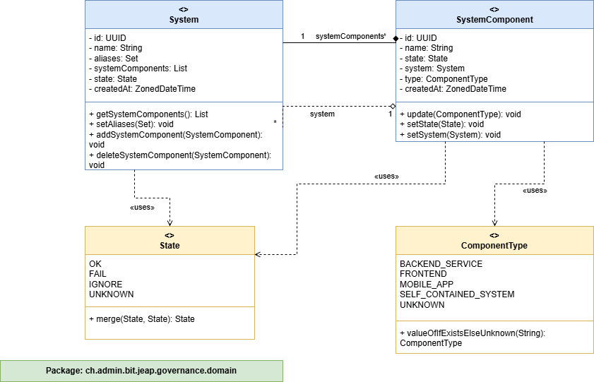
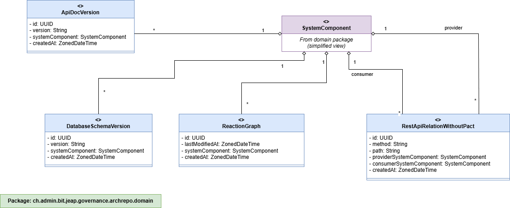
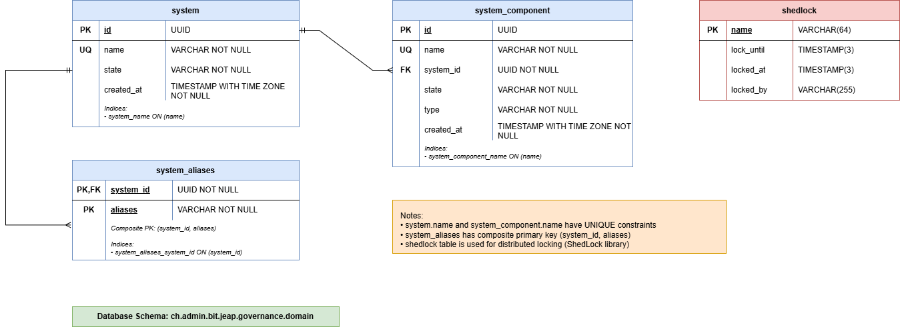

# jeap-governance-service

Service which provides a quick overview of system and service compliance with defined policies.

## Installing / Getting started

Normally you will not use this project directly, but instead set up your own governance service depending on this common library.

## Changes
This library needs to be versioned using [Semantic Versioning](http://semver.org/) and all changes need to be documented at [CHANGELOG.md](./CHANGELOG.md) following the format defined in [Keep a Changelog](http://keepachangelog.com/)

## Note

This repository is part of the open source distribution of jEAP. See [github.com/jeap-admin-ch/jeap](https://github.com/jeap-admin-ch/jeap)
for more information.

## License

This repository is Open Source Software licensed under the [Apache License 2.0](./LICENSE).

## Architecture & Implementation Guide

### Table of Contents

- [Module Overview](#module-overview)
- [Domain Model](#domain-model)
    - [Core Model](#core-model)
    - [ArchRepo Model](#archrepo-model)
- [Database Schema](#database-schema)
    - [Flyway Migration Strategy](#flyway-migration-strategy)
    - [Core Schema](#core-schema)
    - [ArchRepo Schema](#archrepo-schema)
- [Configuration](#configuration)
- [Plugin Mechanism](#plugin-mechanism)
    - [Data Import](#data-import)
    - [Data Deletion](#data-deletion)
- [Metrics](#metrics)

### Module Overview

| Module                             | Description                                                                                                                                                                                                                  | Notes                                                                                |
|------------------------------------|------------------------------------------------------------------------------------------------------------------------------------------------------------------------------------------------------------------------------|--------------------------------------------------------------------------------------|
| `jeap-governance-plugin-api`       | Contains all interfaces for implementing custom logic in concrete instances of the governance service                                                                                                                        | -                                                                                    |
| `jeap-governance-dataimport`       | Schedules the data import process                                                                                                                                                                                            | See [Data Import plugin mechanism](#data-import) and [Configuration](#configuration) |
| `jeap-governance-domain`           | Contains the core model, specifically System and SystemComponent, including data access interfaces                                                                                                                           | -                                                                                    |
| `jeap-governance-service-instance` | Module for easily creating an instance of the governance service                                                                                                                                                             | Instances can define this as their parent                                            |
| `jeap-governance-web`              | Contains REST interfaces and the application itself                                                                                                                                                                          | -                                                                                    |
| `jeap-governance-archrepo`         | Handles integration with the Architecture Repository. Loads the core model and persists it to the database. Can optionally load and persist: ApiDocVersion, DatabaseSchemaVersion, ReactionGraph, RestApiRelationWithoutPact | See [Configuration](#configuration)                                                  |

### Domain Model

#### Core Model

The core model consists of Systems and their associated System Components.



#### ArchRepo Model

The ArchRepo model consists of ApiDocVersion, DatabaseSchemaVersion, ReactionGraph, and RestApiRelationWithoutPact.



### Database

#### Flyway Migration Strategy

We use major version namespaces to clearly separate database migrations for the core and for each plugin/service instance.

##### Version Ranges

| Range                | Purpose                                                                                 |
|----------------------|-----------------------------------------------------------------------------------------|
| `V1_*`               | Core schema - Shared database structure used by all services                            |
| `V1000_*`            | Architecture/shared repository - Reserved for cross-cutting or architectural migrations |
| `V2000_*` and higher | Service/plugin-specific migrations                                                      |

##### Flyway Configuration

We enable out-of-order migrations to allow independent evolution of plugins and services:

```yaml
spring:
  flyway:
    out-of-order: true
```

#### Core Schema



#### ArchRepo Schema


### Configuration

All configuration properties support Spring Boot's standard configuration mechanisms (application.yml, environment variables, etc.).

| Property                                                             | Description                                                                   | Default                       | Required  |
|----------------------------------------------------------------------|-------------------------------------------------------------------------------|-------------------------------|-----------|
| `jeap.governance.archrepo.url`                                       | URL of the Architecture Repository                                            | -                             | No        |
| `jeap.governance.dataimport.cron-expression`                         | Cron expression to schedule the data import job                               | `0 15 6,10,14,18 * * MON-FRI` | No        |
| `jeap.governance.dataimport.lock-at-least`                           | Minimum duration for which the lock should be held during the data import job | `PT30M`                       | No        |
| `jeap.governance.dataimport.lock-at-most`                            | Maximum lock duration for the data import job                                 | `PT2H`                        | No        |
| `jeap.governance.archrepo.timeout`                                   | Connection timeout for Architecture Repository integration                    | `PT5M`                        | No        |
| `jeap.governance.archrepo.import.apidocversion.enabled`              | Enable/disable import of API documentation versions from ArchRepo             | `true`                        | No        |
| `jeap.governance.archrepo.import.databaseschemaversion.enabled`      | Enable/disable import of database schema versions from ArchRepo               | `true`                        | No        |
| `jeap.governance.archrepo.import.reactiongraph.enabled`              | Enable/disable import of reaction graphs from ArchRepo                        | `true`                        | No        |
| `jeap.governance.archrepo.import.restapirelationwithoutpact.enabled` | Enable/disable import of REST API relations without Pact from ArchRepo        | `true`                        | No        |

#### Example Configuration

```yaml
jeap:
  governance:
    archrepo:
      url: https://archrepo.example.com
      timeout: PT5M
      import:
        apidocversion:
          enabled: true
        databaseschemaversion:
          enabled: true
        reactiongraph:
          enabled: false
        restapirelationwithoutpact:
          enabled: true
    dataimport:
      cron-expression: "0 15 6,10,14,18 * * MON-FRI"
      lock-at-least: PT30M
      lock-at-most: PT2H
```

### Plugin Mechanism

The governance service provides several extension points, which are explained in this chapter.

#### Data Import

Instances of the governance service can collect their own data. To do so, the governance service offers an interface:

```java
public interface DataSourceImporter {

    /**
     * Imports data from the external data source into the governance system.
     */
    void importData();

}
```

**Implementation:**
1. Implement the `DataSourceImporter` interface
2. Add the implementation as a Spring bean
3. It will be automatically included in the data import process

**Example:**

```java
@Component
public class CustomDataImporter implements DataSourceImporter {
    
    @Override
    public void importData() {
        // Your custom import logic here
    }
}
```

#### Data Deletion

If you hold data in instances of the governance service that reference SystemComponents, you can be notified before a SystemComponent is deleted. This is necessary to perform certain data cleanup operations. You implement an interface for this:

```java
/**
 * Should be annotated with {@code org.springframework.core.annotation.Order} to define the sort order
 */
public interface ComponentDeletionListener {

    /**
     * This method is called before a component identified by {@code systemComponentId} is deleted.
     * Implementations should perform any necessary cleanup or data removal related to the component.
     *
     * @param systemComponentId the unique identifier of the component to be deleted
     */
    void preComponentDeletion(UUID systemComponentId);

}
```

**Implementation:**
1. Implement the `ComponentDeletionListener` interface
2. Optionally annotate with `@Order` to control execution sequence
3. Add the implementation as a Spring bean
4. It will be automatically included in the deletion process

**Example:**

```java
@Component
public class CustomCleanupListener implements ComponentDeletionListener {
    
    @Override
    public void preComponentDeletion(UUID systemComponentId) {
        // Cleanup logic before component deletion
    }
}
```

### Metrics

The governance service provides the following Prometheus-compatible metrics for monitoring the data import process.

| Metric                                                       | Description                                                                                                                                                                                                                                       | Labels                                                                                                                                                                                                                                        | Example                                                                                                                             |
|--------------------------------------------------------------|---------------------------------------------------------------------------------------------------------------------------------------------------------------------------------------------------------------------------------------------------|-----------------------------------------------------------------------------------------------------------------------------------------------------------------------------------------------------------------------------------------------|-------------------------------------------------------------------------------------------------------------------------------------|
| `jeap_governance_service_data_import_duration_seconds_count` | **Counter** tracking the total number of data import executions per data source connector. Use this to track how many times each import has been executed and monitor success/failure rates.                                                      | • `data_source_connector`: Import connector type (`ArchRepoSystemImport`, `ApiDocVersionImport`, `DatabaseSchemaVersionImport`, `ReactionGraphImport`, `RestApiRelationWithoutPactImport`)<br>• `success`: Execution status (`true`, `false`) | `jeap_governance_service_data_import_duration_seconds_count{data_source_connector="ApiDocVersionImport",success="true"} 2`          |
| `jeap_governance_service_data_import_duration_seconds_sum`   | **Summary** tracking the cumulative duration (in seconds) of all data import executions per data source connector. Use this to calculate average import durations (sum/count) and monitor performance trends over time.                           | • `data_source_connector`: Import connector type (`ArchRepoSystemImport`, `ApiDocVersionImport`, `DatabaseSchemaVersionImport`, `ReactionGraphImport`, `RestApiRelationWithoutPactImport`)<br>• `success`: Execution status (`true`, `false`) | `jeap_governance_service_data_import_duration_seconds_sum{data_source_connector="ApiDocVersionImport",success="true"} 0.748848553`  |
| `jeap_governance_service_data_import_duration_seconds_max`   | **Gauge** tracking the maximum observed duration (in seconds) for data import executions within the current observation window. Use this to identify performance outliers and detect import operations that take significantly longer than usual. | • `data_source_connector`: Import connector type (`ArchRepoSystemImport`, `ApiDocVersionImport`, `DatabaseSchemaVersionImport`, `ReactionGraphImport`, `RestApiRelationWithoutPactImport`)<br>• `success`: Execution status (`true`, `false`) | `jeap_governance_service_data_import_duration_seconds_max{data_source_connector="ArchRepoSystemImport",success="true"} 2.118972172` |
| `jeap_governance_service_data_import_last_run_from_minutes`  | **Gauge** indicating how many minutes have elapsed since the last successful data import execution (across all import connectors). Use this for alerting to detect when data imports have not run for an unexpectedly long time.                  | None                                                                                                                                                                                                                                          | `jeap_governance_service_data_import_last_run_from_minutes 4.0`                                                                     |

### Recommended Alerts

Based on these metrics, consider setting up the following alerts:

1. **Import Failures:**
```promql
   rate(jeap_governance_service_data_import_duration_seconds_count{success="false"}[5m]) > 0
```

2. **Import Not Running:**
```promql
   jeap_governance_service_data_import_last_run_from_minutes > 120
```

3. **Slow Imports:**
```promql
   jeap_governance_service_data_import_duration_seconds_max > 300
```

