# jeap-governance-service

Service template to provide a quick overview of system and service compliance with defined policies. A service instance 
can be created by depending on this template,then adding specific configuration and extending it with plugin 
implementations.

## Key Features
      
- **Developer Feedback:** Teams receive clear information on whether their services comply with 
        organizational policies
- **Flexible Rule Management:** Administrators can temporarily deactivate individual rules for 
     specific systems or services when exceptions are needed
- **Extensible Rules Engine:** New compliance rules can be easily added through a plugin mechanism, 
     allowing teams to provide their own custom rules


## Installing / Getting started

Normally you will not use this project directly, but instead set up your own governance service depending on this common library. Check the documentation in confluence for details.

## Changes
This library needs to be versioned using [Semantic Versioning](http://semver.org/) and all changes need to be documented at [CHANGELOG.md](./CHANGELOG.md) following the format defined in [Keep a Changelog](http://keepachangelog.com/)

## Note

This repository is part of the open source distribution of jEAP. See [github.com/jeap-admin-ch/jeap](https://github.com/jeap-admin-ch/jeap)
for more information.

## License

This repository is Open Source Software licensed under the [Apache License 2.0](./LICENSE).

## Architecture & Implementation Guide

### Table of Contents

- [Module Overview](#module-overview)
- [Domain Model](#domain-model)
  - [Core Model](#core-model)
  - [Scoring and Rule Models](#scoring-and-rule-models)
  - [ArchRepo Model](#archrepo-model)
  - [DeploymentLog Model](#deploymentlog-model)
  - [Prometheus Model](#prometheus-time-series-model)
  - [Security Scan Model](#security-scan-model)
- [Database](#database)
  - [Flyway Migration Strategy](#flyway-migration-strategy)
  - [Core Schema](#core-schema)
  - [ArchRepo Schema](#archrepo-schema)
  - [DeploymentLog Schema](#deploymentlog-schema)
  - [Prometheus Schema](#prometheus-time-series-schema)
  - [Security Scan Schema](#security-scan-schema)
- [Configuration](#configuration)
  - [Prometheus Query Lookback](#prometheus-query-lookback)
  - [Example Configuration](#example-configuration)
- [Plugin Mechanism](#plugin-mechanism)
  - [Data Import](#data-import)
  - [Data Deletion](#data-deletion)
- [Rules](#rules)
- [Metrics](#metrics)
- [Reporting](#reporting)
- [Recommended Alerts](#recommended-alerts)

### Module Overview

| Module                             | Description                                                                                                                                                                                                   | Notes                                                                                      |
|------------------------------------|---------------------------------------------------------------------------------------------------------------------------------------------------------------------------------------------------------------|--------------------------------------------------------------------------------------------|
| `jeap-governance-archrepo`         | Handles integration with the Architecture Repository. Loads the core model and persists it to the database. Can optionally load and persist: ApiDocVersion, DatabaseSchemaVersion, RestApiRelationWithoutPact | See [Configuration](#configuration)                                                        |
| `jeap-governance-dataimport`       | Schedules the data import process                                                                                                                                                                             | See [Data Import plugin mechanism](#data-import) and [Configuration](#configuration)       |
| `jeap-governance-deploymentlog`    | Handles integration with the Deployment Log. Loads the deployment log component versions and persists it to the database.                                                                                     | See [Data Import plugin mechanism](#data-import) and  See [Configuration](#configuration)  | 
| `jeap-governance-reporting`        | Generates governance rule evaluation outcomes to Confluence                                                                                                                                                   | -                                                                                          |
| `jeap-governance-domain`           | Contains the core model, specifically System and SystemComponent, including data access interfaces                                                                                                            | -                                                                                          |
| `jeap-governance-pactbroker`       | Imports data from a PACT broker instance                                                                                                                                                                      | -                                                                                          |
| `jeap-governance-persistence`      | Provides flyway migration scripts and JPA repositories                                                                                                                                                        | -                                                                                          |
| `jeap-governance-prometheus`       | Handles integration with a Prometheus server. Queries the latest samples of selected standard jEAP metrics for the system's service components and persists them to the database.                             | See [Configuration](#configuration)                                                        |
| `jeap-governance-reactionobserver` | Retrieves the last observed reaction date of the system components.                                                                                                                                           | See [Configuration](#configuration)                                                        |
| `jeap-governance-secscan`          | Scans the known HTTP APIs of the system components for unprotected endpoints and persists the flagged endpoints in the database.                                                                              | See [Configuration](#configuration)                                                        |
| `jeap-governance-rules`            | Provides the infrastructure to evaluate governance rules and score services/systems on a regular basis                                                                                                        | Instances can define this as their parent                                                  |
| `jeap-governance-rules-core`       | Built-in governance rules shipped with the service                                                                                                                                                            | Included transitively via `jeap-governance-rules`                                          |
| `jeap-governance-rules-dependency` | Built-in governance dependencies rules shipped with the service                                                                                                                                               | Included transitively via `jeap-governance-rules`   
| `jeap-governance-rules-messaging`  | Built-in governance messaging rules shipped with the service                                                                                                                                                  | Included transitively via `jeap-governance-rules`                                          |
| `jeap-governance-service-instance` | Module for easily creating an instance of the governance service                                                                                                                                              | Instances can define this as their parent                                                  |
| `jeap-governance-web`              | Contains REST interfaces and the application itself                                                                                                                                                           | -                                                                                          |

### Domain Model

#### Core Model

The core model consists of Systems and their associated System Components.

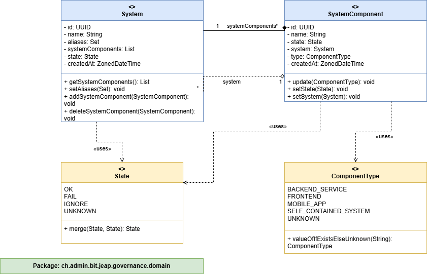

#### Scoring and Rule Models

The scoring model consists of ComponentScore and SystemScore, which are used to capture the results of governance rule
evaluations. The rule model consists of the RuleState of a single system component, and the RuleConformanceRate, which
captures the overall conformance of a rule across all evaluated components.

The ComponentScoreCalculator and SystemScoreCalculator are responsible for calculating the scores based on the
active governance rules and their evaluation results.

A rule for a component can be in any of the following four rule states after evaluation:

- OK: The rule is active and the component complies with the rule.
- FAIL: The rule is active but the component does not comply with the rule.
- PAUSED: The rule is temporarily paused due to a temporary exemption.
- DISABLED: The rule is disabled due to an indefinite exemption.

A component's score is defined as the percentage of active rules that are in the OK state, weighted by the importance
of each rule. A rule is disabled if it has an indefinite exemption. The formula is as follows:

```
score = 100 * (sum(ruleWeight)[ruleState == OK] / sum(ruleWeight)[ruleState != DISABLED])
```

The system score is calculated as the average of the component scores of all components belonging to the system.

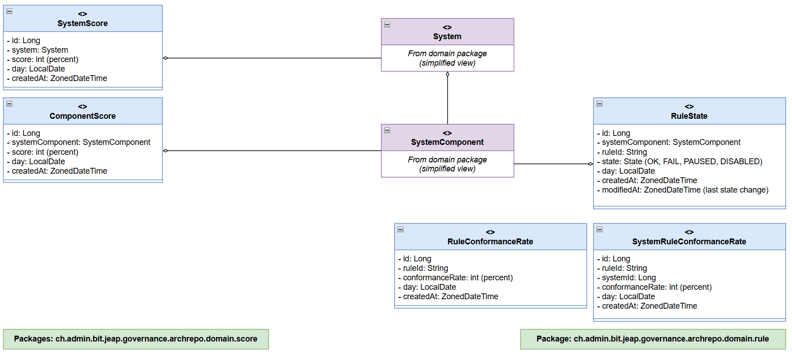

#### ArchRepo Model

The ArchRepo model consists of ApiDocVersion, DatabaseSchemaVersion, and RestApiRelationWithoutPact.

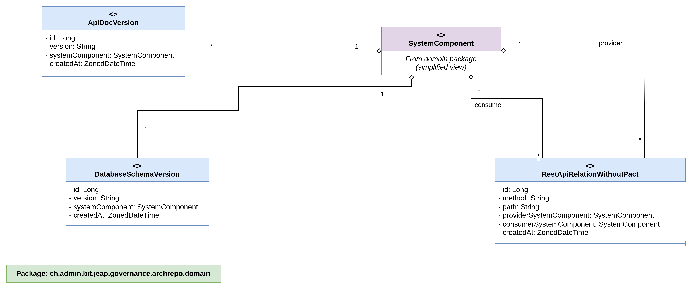

#### DeploymentLog Model

The DeploymentLog model consists of DeploymentLogComponentVersion.

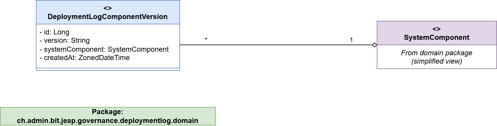

#### ReactionObserver Model

The ReactionObserver model consists of ReactionObserverComponentLastObservationDate.

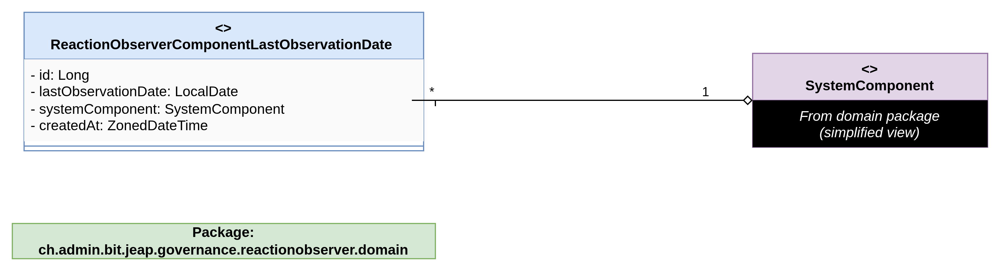

#### Prometheus Time Series Model

The Prometheus domain model records time series samples per service component and query type. Since import queries are
designed to capture the current state of a component aspect (not to retrieve extended time series) only a limited number
of time series samples is expected. Consequently, the model intentionally remains denormalized to keep the domain and
implementation straightforward.

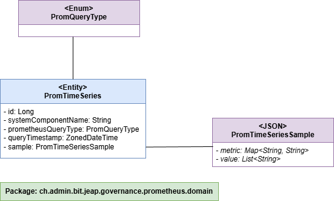

#### Security Scan Model

The secscan module implements a security scan of known system component APIs to identify unprotected endpoints. Known
APIs of a system component are identified via the API discovery service. This service queries a jEAP architecture
repository instance for a system component's REST endpoints. Those endpoints are then checked for security by executing
HTTP requests on them. Endpoints accepting and not rejecting the requests are flagged as unprotected. The scan
result details for flagged endpoints are persisted to SecscanFlaggedEndpoint entities. In addition, a summarizing scan
message is persisted per system component in a SecscanState entity. A configurable endpoint filter allows to filter out
certain APIs and endpoints from the scan, e.g. to exclude APIs or endpoints that are expected to be unprotected.

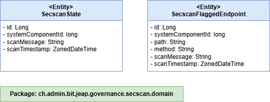

### Database

#### Flyway Migration Strategy

We use major version namespaces to clearly separate database migrations for the core and for each plugin/service instance.

##### Version Ranges

| Range                   | Purpose                                                            |
|-------------------------|--------------------------------------------------------------------|
| `V1_*`                  | Core schema - Shared database structure used by all services       |
| `V1000_*` to `V1999_*'  | Reserved for modules within the jeap-governance-service reposiotry |
| `V2000_*` and higher    | Service/plugin-specific migrations                                 |

##### Flyway Configuration

We enable out-of-order migrations to allow independent evolution of plugins and services:

```yaml
spring:
  flyway:
    out-of-order: true
```

#### Core Schema

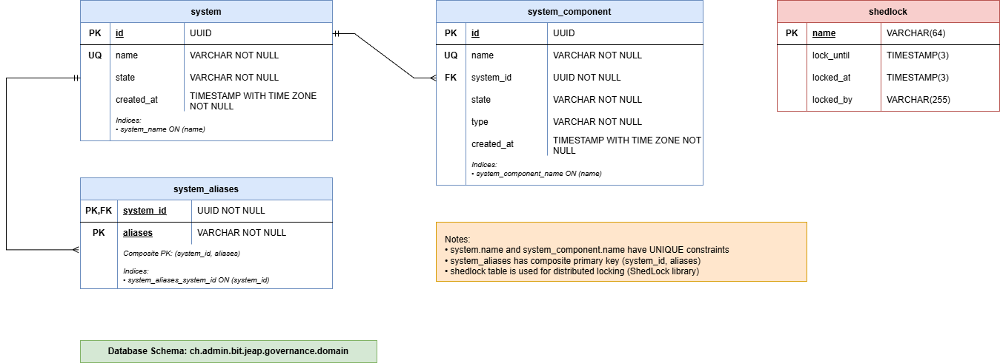

#### Scoring Schema

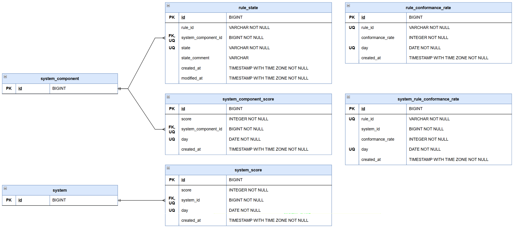

#### Scheduler Run Table

The `scheduler_run` table persists the last successful run timestamp per scheduler job (data-import, scoring,
reporting).
This ensures that the `jeap_governance_service_*_last_run_from` metrics report correctly even after application restarts
or redeployments.

| Column        | Type        | Description                                       |
|---------------|-------------|---------------------------------------------------|
| `job_name`    | `VARCHAR`   | Primary key, identifies the scheduler job         |
| `last_run_at` | `TIMESTAMP` | Timestamp of the last successful run for this job |

#### ArchRepo Schema

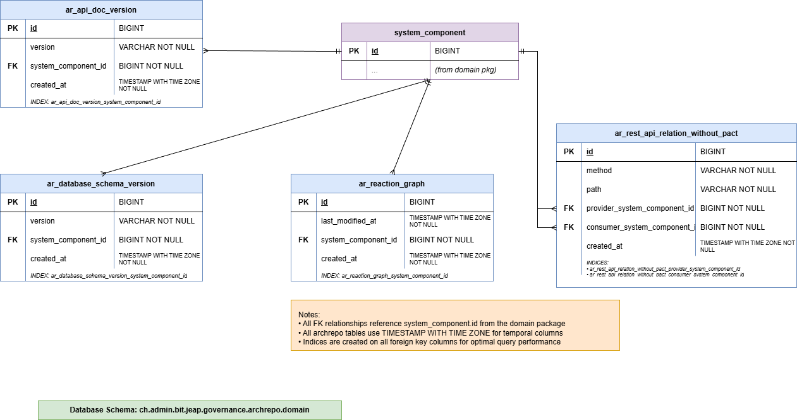

#### DeploymentLog Schema

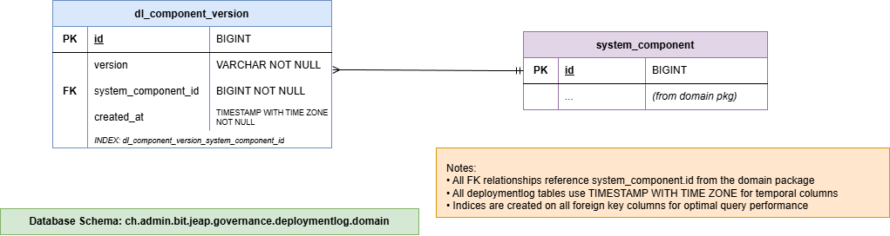

#### ReactionObserver Schema

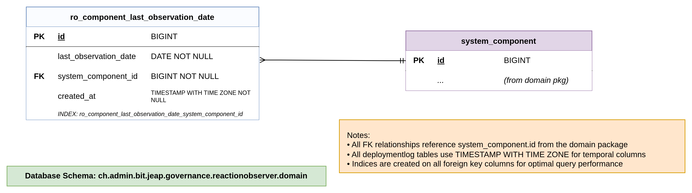

#### Prometheus Time Series Schema

The Prometheus database schema is designed around the assumption that import queries capture the current state of a
component aspect rather than extended time series. As a result, only a limited number of samples is expected to be
stored. Consequently, the schema intentionally remains denormalized (avoiding additional normalization of sample
storage) to keep both the data model and the implementation straightforward.

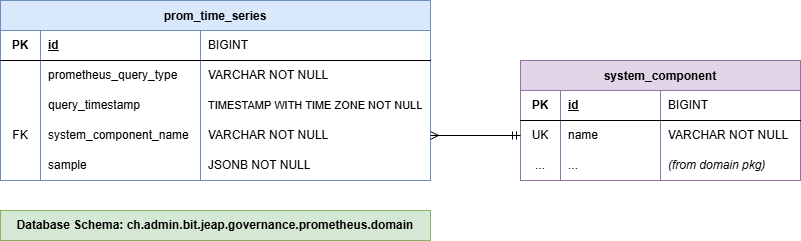

#### Security Scan Schema

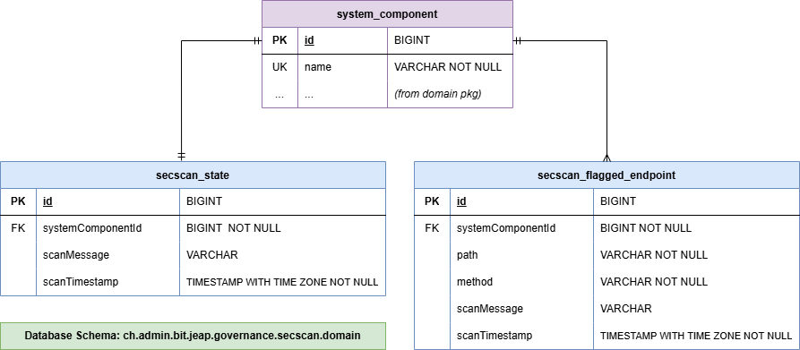

### Configuration

All configuration properties support Spring Boot's standard configuration mechanisms (application.yml, environment variables, etc.).

| Property                                                             | Description                                                                                                                                            | Default                       | Required                         |
|----------------------------------------------------------------------|--------------------------------------------------------------------------------------------------------------------------------------------------------|-------------------------------|----------------------------------|
| `jeap.governance.environment`                                        | Environment of the service(DEV, REF, ABN, PROD).                                                                                                       | -                             | Yes                              |
| `jeap.governance.archrepo.url`                                       | URL of the Architecture Repository                                                                                                                     | -                             | Yes                              |
| `jeap.governance.dataimport.cron-expression`                         | Cron expression to schedule the data import job                                                                                                        | `0 15 6,10,14,18 * * MON-FRI` | No                               |
| `jeap.governance.dataimport.lock-at-least`                           | Minimum duration for which the lock should be held during the data import job                                                                          | `PT30M`                       | No                               |
| `jeap.governance.dataimport.lock-at-most`                            | Maximum lock duration for the data import job                                                                                                          | `PT2H`                        | No                               |
| `jeap.governance.archrepo.timeout`                                   | Connection timeout for Architecture Repository integration                                                                                             | `PT5M`                        | No                               |
| `jeap.governance.archrepo.import.apidocversion.enabled`              | Enable/disable import of API documentation versions from ArchRepo                                                                                      | `true`                        | No                               |
| `jeap.governance.archrepo.import.databaseschemaversion.enabled`      | Enable/disable import of database schema versions from ArchRepo                                                                                        | `true`                        | No                               |
| `jeap.governance.archrepo.import.restapirelationwithoutpact.enabled` | Enable/disable import of REST API relations without Pact from ArchRepo                                                                                 | `true`                        | No                               |
| `jeap.governance.deploymentlog.enabled`                              | Enable/disable import of data from the of DeploymentLog                                                                                                | `true`                        | No                               |
| `jeap.governance.deploymentlog.url`                                  | URL of the DeploymentLog                                                                                                                               | -                             | Yes, if deploymentlog enabled    |
| `jeap.governance.deploymentlog.username`                             | Username to access the DeploymentLog                                                                                                                   | -                             | Yes, if deploymentlog enabled    |
| `jeap.governance.deploymentlog.password`                             | Password to access the DeploymentLog                                                                                                                   | -                             | Yes, if deploymentlog enabled    |
| `jeap.governance.deploymentlog.timeout`                              | DeploymentLog connection timeout duration.                                                                                                             | 'PT5M'                        | No                               |
| `jeap.governance.prometheus.enablede`                                | Enable/disable the import of time series from Prometheus                                                                                               | 'true'                        | No                               |
| `jeap.governance.prometheus.amp.host`                                | Amazon Managed Prometheus host URL                                                                                                                     | -                             | Yes, if enabled                  |
| `jeap.governance.prometheus.amp.workspace`                           | Amazon Managed Prometheus workspace id                                                                                                                 | -                             | Yes, if enabled                  |
| `jeap.governance.prometheus.amp.role-arn`                            | ARN of the role to assume for accessing the Amazon Managed Prometheus                                                                                  | -                             | Yes, if enabled                  |
| `jeap.governance.prometheus.amp.role-session-name`                   | Name of the session to be used for accessing the Amazon Managed Prometheus                                                                             | -                             | Yes, if enabled                  |
| `jeap.governance.prometheus.amp.query-lookback`                      | How far back the Prometheus queries look for the most recent sample of a service                                                                       | 'PT6H'                        | No                               |
| `jeap.governance.reactionobserver.enabled`                           | Enable/disable import of data from the of ReactionObserver                                                                                             | `true`                        | No                               |
| `jeap.governance.reactionobserver.url`                               | URL of the ReactionObserver                                                                                                                            | -                             | Yes, if ReactionObserver enabled |
| `jeap.governance.reactionobserver.username`                          | Username to access the ReactionObserver                                                                                                                | -                             | Yes, if ReactionObserver enabled |
| `jeap.governance.reactionobserver.password`                          | Password to access the ReactionObserver                                                                                                                | -                             | Yes, if ReactionObserver enabled |
| `jeap.governance.reactionobserver.timeout`                           | ReactionObserver connection timeout duration.                                                                                                          | 'PT5M'                        | No                               |
| `jeap.governance.secscan.enabled`                                    | Enable/disable the security scan of known system component APIs                                                                                        | true                          | No                               |
| `jeap.governance.secscan.dataimport.target-environment`              | Environment to perform the security scan on                                                                                                            | REF                           | No                               |
| `jeap.governance.secscan.apidiscovery.url-template`                  | URL template of the API discovery service containing the parameters {env} and {systemComponentName}                                                    | true                          | No                               |
| `jeap.governance.secscan.apidiscovery.timeout`                       | Timout (specified as duration) for the connect and read timeouts when accessing the API discovery service                                              | true                          | No                               |
| `jeap.governance.secscan.httpcheck.connect-timeout`                  | Timout (specified as duration) for the connect timeout when checking an HTTP endpoint                                                                  | true                          | No                               |
| `jeap.governance.secscan.httpcheck.read-timeout`                     | Timout (specified as duration) for the read timeout when checking an HTTP endpoint                                                                     | true                          | No                               |
| `jeap.governance.rules.active[].id`                                  | Rule identifier, must match a known rule implementation                                                                                                | -                             | Yes                              |
| `jeap.governance.rules.active[].weight`                              | Rule weight for scoring (positive integer, >= 1)                                                                                                       | -                             | Yes                              |
| `jeap.governance.rules.active[].documentation-link`                  | Optional link to the documentation for this rule, used in governance reports                                                                           | -                             | No                               |
| `jeap.governance.rules.active[].parameters`                          | Optional key-value parameters passed to the rule                                                                                                       | `{}`                          | No                               |
| `jeap.governance.rules.component-exemptions[].id`                    | Unique exemption identifier                                                                                                                            | -                             | Yes                              |
| `jeap.governance.rules.component-exemptions[].component-name`        | Name of the component this exemption applies to                                                                                                        | -                             | Yes                              |
| `jeap.governance.rules.component-exemptions[].rule-id`               | List of rule IDs this exemption covers                                                                                                                 | -                             | Yes                              |
| `jeap.governance.rules.component-exemptions[].reason`                | Explanation for the exemption                                                                                                                          | -                             | Yes                              |
| `jeap.governance.rules.component-exemptions[].until`                 | Expiry date (ISO-8601 `yyyy-MM-dd`). If absent, the exemption is permanent                                                                             | -                             | No                               |
| `jeap.governance.rules.component-exemptions[].parameters`            | Optional key-value parameters to further scope the exemption                                                                                           | `{}`                          | No                               |
| `jeap.governance.scoring.cron-expression`                            | Cron expression to schedule the rule evaluation and scoring of components/systems                                                                      | `0 0,45 6-20 * * MON-FRI`     | No                               |
| `jeap.governance.scoring.lock-at-least`                              | Minimum duration for which the lock should be held during the data import job                                                                          | `PT1M`                        | No                               |
| `jeap.governance.scoring.lock-at-most`                               | Maximum lock duration for the data import job                                                                                                          | `PT15M`                       | No                               |
| `jeap.governance.reporting.enabled`                                  | Enables or disables the reporting job                                                                                                                  | `false`                       | No                               |
| `jeap.governance.reporting.cron-expression`                          | Cron expression for the reporting job. Defaults to 55 minutes past the hour to avoid overlap with the data import job (:15) and scoring job (:00, :45) | `0 55 6-20 * * MON-FRI`       | No                               |
| `jeap.governance.reporting.orphancleanup.cron-expression`            | Cron expression for the orphan page cleanup job                                                                                                        | `0 10 3 * * MON-FRI`          | No                               |
| `jeap.governance.reporting.lock-at-least`                            | Minimum lock duration for the reporting job (ISO-8601 duration)                                                                                        | `PT1M`                        | No                               |
| `jeap.governance.reporting.lock-at-most`                             | Maximum lock duration for the reporting job (ISO-8601 duration)                                                                                        | `PT20M`                       | No                               |
| `jeap.governance.reporting.trendPeriodDays`                          | Number of days used to calculate the trend                                                                                                             | `30`                          | No                               |
| `jeap.governance.reporting.confluence.url`                           | Base URL of the Confluence instance                                                                                                                    | —                             | Yes, if reporting is enabled     |
| `jeap.governance.reporting.confluence.space-key`                     | Confluence space key where pages will be created or updated                                                                                            | —                             | Yes, if reporting is enabled     |
| `jeap.governance.reporting.confluence.root-page-name`                | Name of the root page under which reports are published                                                                                                | —                             | Yes, if reporting is enabled     |
| `jeap.governance.reporting.confluence.ancestor-id`                   | ID of the ancestor page under which reports are published                                                                                              | —                             | Yes, if reporting is enabled     |
| `jeap.governance.reporting.confluence.username`                      | Username for Confluence authentication                                                                                                                 | —                             | Yes, if reporting is enabled     |
| `jeap.governance.reporting.confluence.password`                      | Password for Confluence authentication                                                                                                                 | —                             | Yes, if reporting is enabled     |

#### Prometheus Query Lookback

All Prometheus queries return the most recent sample a service exported within the lookback window configured with
`jeap.governance.prometheus.amp.query-lookback` (default six hours).

The window is not a memory: once a service stops exporting a time series, that series drops out of the query results
after the window has elapsed, and the rules based on Prometheus data no longer see it. The window only tolerates a
service not being scraped for a while, for example while it is being redeployed.

This has two consequences when choosing the value:

- A shorter window makes the rules reflect a changed service configuration sooner - at the next data import rather than
  after the window has elapsed. For example, an endpoint that is no longer exposed disappears from the
  `endpoints-protected-by-jwt` rule once the redeployed service has stopped exporting the corresponding metric for
  longer than the window. Note that the metric value alone does not tell the rule whether a violation is still current:
  the counter behind `jeap_rest_endpoint_without_jwt_total` keeps its last value for as long as the service runs.
- A longer window keeps rules from failing for a service that is not permanently running or scraped. If components are
  regularly unavailable at data import time, either raise the lookback or configure a `violation-delay` for the
  affected rules.

#### Example Configuration

```yaml
jeap:
  governance:
    environment: DEV
    dataimport:
      cron-expression: "0 15 6,10,14,18 * * MON-FRI"
      lock-at-least: PT30M
      lock-at-most: PT2H
    scoring:
      cron-expression: "0 0,45 6-20 * * MON-FRI"
      lock-at-least: PT1M
      lock-at-most: PT15M
    archrepo:
      url: https://archrepo.example.com
      timeout: PT5M
      import:
        apidocversion:
          enabled: true
        databaseschemaversion:
          enabled: true
        restapirelationwithoutpact:
          enabled: true
    deploymentlog:
      enabled: true
      url: https://deploymentlog.example.com
      username: deploymentlog_user
      password: securepassword
      timeout: PT15M
    reactionobserver:
      enabled: true
      url: https://reactionobserver.example.com
      username: reactionobserver_user
      password: securepassword
      timeout: PT15M
    prometheus:
      enabled: true
      amp:
        host: "https://aps-workspaces.eu-central-1.amazonaws.com"
        workspace: "ws-4f9f438a-efdf-4081-9745-fc4a0ad35f32b2"
        role-arn: "arn:aws:iam::892367255812:role/amp-read-assume-role"
        role-session-name: mySession
    secscan:
        enabled: true
        dataimport:
          target-environment: REF
        apidiscovery:
          url-template: "https://api-discovery.{env}-example.com/apis/{systemComponentName}"
    reporting:
      enabled: true
      cron-expression: "0 55 6-20 * * MON-FRI"
      orphancleanup:
        cron-expression: "0 10 3 * * MON-FRI"
      lock-at-least: PT1M
      lock-at-most: PT20M
      trendPeriodDays: 30
      confluence:
        url: https://confluence.example.com
        space-key: GOV
        root-page-name: Governance Reports
        username: confluence_user
        password: securepassword
    rules:
      active:
        - id: component-name
          weight: 10
        - id: enforce-oauth2
          weight: 10
          documentation-link: https://wiki.example.com/enforce-oauth2
        - id: custom-rule
          weight: 5
          parameters:
            threshold: 10
      component-exemptions:
        - id: my-exemption
          component-name: my-system-legacy-service
          rule-id:
            - enforce-oauth2
          reason: "Legacy service, migration planned"
          until: "2026-12-31"
```

### Plugin Mechanism

The governance service provides several extension points, which are explained in this chapter.

Plugin beans must be registered in the Spring context using autoconfiguration. Create a configuration class annotated with `@AutoConfiguration` that declares your plugin beans, and register it in `META-INF/spring/org.springframework.boot.autoconfigure.AutoConfiguration.imports`.

#### Data Import

Instances of the governance service can collect their own data. To do so, the governance service offers an interface:

```java
public interface DataSourceImporter {

    /**
     * Imports data from the external data source into the governance system.
     */
    void importData();

}
```

**Implementation:**
1. Implement the `DataSourceImporter` interface
2. Add the implementation as a Spring bean
3. It will be automatically included in the data import process

**Example:**

```java
@Component
public class CustomDataImporter implements DataSourceImporter {
    
    @Override
    public void importData() {
        // Your custom import logic here
    }
}
```

#### Data Deletion

If you hold data in instances of the governance service that reference SystemComponents, you can be notified before a SystemComponent is deleted. This is necessary to perform certain data cleanup operations. You implement an interface for this:

```java
/**
 * Should be annotated with {@code org.springframework.core.annotation.Order} to define the sort order
 */
public interface ComponentDeletionListener {

    /**
     * This method is called before a component identified by {@code systemComponentId} is deleted.
     * Implementations should perform any necessary cleanup or data removal related to the component.
     *
     * @param systemComponentId the unique identifier of the component to be deleted
     */
    void preComponentDeletion(long systemComponentId);

}
```

**Implementation:**
1. Implement the `ComponentDeletionListener` interface
2. Optionally annotate with `@Order` to control execution sequence
3. Add the implementation as a Spring bean
4. It will be automatically included in the deletion process

**Example:**

```java
@Component
public class CustomCleanupListener implements ComponentDeletionListener {

  @Override
  public void preComponentDeletion(long systemComponentId) {
    // Cleanup logic before component deletion
  }
}
```

If you hold data in instances of the governance service that reference Systems, you can be notified before a System is deleted. This is necessary to perform certain data cleanup operations. You implement an interface for this:

```java
public interface SystemDeletionListener {

    /**
     * This method is called before a system identified by {@code systemId} is deleted.
     * Implementations should perform any necessary cleanup or data removal related to the system.
     *
     * @param systemId the unique identifier of the system to be deleted
     */
    void preSystemDeletion(long systemId);

}
```

**Implementation:**
1. Implement the `SystemDeletionListener` interface
2. Optionally annotate with `@Order` to control execution sequence
3. Add the implementation as a Spring bean
4. It will be automatically included in the deletion process

### Rules

The governance service provides an infrastructure to evaluate governance rules and score services/systems on a regular
basis. Besides using predefined rules, you may also provide custom rules specific to your context.

**Implementation:**
1. Implement the `Rule` interface (see [Rule.java](./jeap-governance-plugin-api/src/main/java/ch/admin/jeap/governance/plugin/api/rule/Rule.java)
2. Inject any necessary repositories into your implementation to access the data you need for the rule evaluation
3. Provide the rule as a Spring bean
4. It will be automatically be evaluated during the regular rule evaluation process

#### Built-in Rules

The `jeap-governance-rules-core` module ships the following built-in rules:

| Rule ID                           | Description                                                                                     |
|-----------------------------------|-------------------------------------------------------------------------------------------------|
| `component-naming-convention`     | Validates that component names follow the convention `{system-name}-{context}-{type-id}`.       |
| `component-produces-metrics`      | Checks that a component has Prometheus metrics data available.                                  |
| `component-publishes-dbschema`    | Checks that a component publishes its database schema in the architecture repository.           |
| `component-publishes-openapispec` | Checks that a component publishes its OpenAPI specification in the architecture repository.     |
| `endpoints-protected-by-jwt`      | Checks that REST endpoints are protected by a JWT bearer token based on a corresponding metric. |

**Component Naming Convention Rule** (`component-naming-convention`)

Splits the component name by `-` and validates three parts:

1. **System name** (first part) — must match `[a-z]+[a-z0-9_]*` and equal the owning system's name or one of its
   aliases (case-insensitive).
2. **Context** (middle parts joined by `-`) — must match `[a-z]+[a-z0-9-]*`.
3. **Type-id** (last part) — must be one of: `service`, `ui`, `scs`, `mobileapp`, `gateway`, `db`.

Names with fewer than 3 parts fail immediately.

**Component Produces Metrics Rule** (`component-produces-metrics`)

Verifies that at least one Prometheus time series exists for the component. This ensures that the
`jeap-spring-boot-monitoring-starter` dependency is added and the monitoring configuration is working correctly.
Requires the Prometheus module to be enabled (`jeap.governance.prometheus.enabled=true`).

**Component Publishes DB Schema Rule** (`component-publishes-dbschema`)

This rule verifies that a component publishes its database schema to the architecture repository.

Some components can be excluded from this check using the `ignored-service-names` parameter. This is useful for services that:

- Do not use a database
- Are not required to publish a database schema

Multiple service names can be specified as list elements.

Configuration Example:

```yaml
jeap:
  governance:
    rules:
      active:
        - id: component-publishes-dbschema
          weight: 3
          parameters:
            ignored-service-names: 
              - ignored-service
              - foobar-service

```

To use this rule, the following modules must be enabled:
- Prometheus module (`jeap.governance.prometheus.enabled=true`)
- DeploymentLog module (`jeap.governance.deploymentlog.enabled=true`)
- Database Schema Version in ArchRepo module (`jeap.governance.archrepo.import.databaseschemaversion.enabled=true`)

**Component Publishes OpenAPI Specification Rule** (`component-publishes-openapispec`)

This rule verifies that a component publishes its OpenAPI specification to the architecture repository.

To use this rule, the following modules must be enabled:
- DeploymentLog module (`jeap.governance.deploymentlog.enabled=true`)
- API Doc Version in ArchRepo module (`jeap.governance.archrepo.import.apidocversion.enabled=true`)

**REST Endpoint Security (Monitoring) Rule** (`endpoints-protected-by-jwt`)

This rule checks that REST endpoints of a component are protected by JWT authentication, based on Prometheus monitoring
data. Endpoints detected without JWT protection are reported as violations.

The rule applies several default exclusions, i.e. some endpoints are always ignored (unless disabled via the
`disable-default-exemptions` parameter):

- Actuator endpoints (any path containing `/actuator`)
- API docs and Swagger UI endpoints (`/api-docs`, `/swagger-ui`) on the `ref` environment only
- Wildcard frontend endpoints (`/**`, `/`)
- Configuration API calls (matching the pattern `/(ui-)?(ui)?(api)?(/)?(\w)*/((\\w)*-)?configuration(\S)*`)

The following exemption parameters can be used to exclude additional components or endpoints from being checked.
All list parameters support YAML list syntax. Wildcard matching is supported using `*` for prefix matching (e.g.,
`/api/*` matches all paths starting with `/api/`) and suffix matching (e.g., `*-service` matches all names ending
with `-service`).

| Parameter                    | Description                                                                 |
|------------------------------|-----------------------------------------------------------------------------|
| `exempt-component-names`     | List of component names to exclude entirely (wildcards supported).          |
| `exempt-methods`             | List of HTTP methods to exclude (e.g., `OPTIONS`). Case-insensitive.       |
| `exempt-paths`               | List of URL paths to exclude (wildcards supported).                         |
| `exempt-endpoints`           | List of `METHOD:PATH` pairs to exclude (e.g., `GET:/api/public/*`).        |
| `disable-default-exemptions` | Set to `true` to disable all default exemptions listed above.              |

Configuration Example:

```yaml
jeap:
  governance:
    rules:
      active:
        - id: endpoints-protected-by-jwt
          weight: 5
          parameters:
            exempt-component-names:
              - "*-testagent-service"
            exempt-methods:
              - OPTIONS
            exempt-paths:
              - /public/*
            exempt-endpoints:
              - GET:/api/public/*
              - POST:/api/webhooks/*
```

To use this rule, the following module must be enabled:
- Prometheus module (`jeap.governance.prometheus.enabled=true`)

An endpoint is reported for as long as the service exports the corresponding metric. A service that no longer exposes
an endpoint stops reporting it once it has been redeployed and the
[Prometheus query lookback](#prometheus-query-lookback) has elapsed.

#### Built-in Messaging Rules

The `jeap-governance-rules-messaging` module ships the following built-in rules:

| Rule ID                                | Description                                           |
|----------------------------------------|-------------------------------------------------------|
| `component-defines-messagingcontracts` | Validates that component defines messaging contracts. |
| `component-consumes-signedmessages`    | Validates that component consumes signed messages.    |
| `component-produces-signedmessages`    | Validates that component produces signed messages.    |
| `component-uses-latest-message-versions` | Validates that deployed contracts use the latest message versions. |

**Component Defines Messaging Contracts Rule** (`component-defines-messagingcontracts`)

This rule verifies that a component defines messaging contracts. It evaluates the `jeap_messaging_contract` metric
reported by the component and fails if any of the following contract validation switches is enabled:

| Switch                       | Failure reason                                        |
|------------------------------|-------------------------------------------------------|
| `noMasterContracts`          | Contracts are loaded from a branch other than master. |
| `consumeWithoutContract`     | Consuming messages without a contract is allowed.     |
| `publishWithoutContract`     | Publishing messages without a contract is allowed.    |
| `silentIgnoreWithoutContract`| Messages without a contract are silently ignored.     |

If the metric is not present (no messaging library detected), the rule passes.

To use this rule, the following modules must be enabled:
- Prometheus module (`jeap.governance.prometheus.enabled=true`)

**Component Uses Latest Message Versions** (`component-uses-latest-message-versions`)

This rule compares the versions in the currently deployed message contracts with the latest semantic versions in the
message type registry. Contract version data is imported from the Message Contract Service before rule evaluation.
Configure the endpoint URL as a URI template containing the `{environment}` placeholder. A violation delay can be used
to give teams a grace period before an outdated contract affects their governance score.

```yaml
jeap:
  governance:
    message-contract:
      enabled: true
      url: https://message-contract-service/api/contracts/version-status?env={environment}
      environment: PROD
      username: governance-reader
      password: ${MESSAGE_CONTRACT_PASSWORD}
      timeout: 30s
    rules:
      active:
        - id: component-uses-latest-message-versions
          weight: 5
          violation-delay: 70d
```

During `violation-delay`, a continuous violation is reported in the rule comment but remains compliant for scoring.
Once the delay expires it becomes a regular rule failure. A successful evaluation resets the delay.
Imported version status is persisted as a shared database snapshot so import and scoring can run on different service
replicas. If no version status data is available, the rule is compliant. A failed import retains the previous snapshot.
The configured user requires the `messagecontract-read` role.

**Component Consumes Signed Messages** (`component-consumes-signedmessages`)

This rule verifies that a component consumes signed messages.

To use this rule, the following modules must be enabled:
- Prometheus module (`jeap.governance.prometheus.enabled=true`)

**Component Produces Signed Messages** (`component-produces-signedmessages`)

This rule verifies that a component produces signed messages.

To use this rule, the following modules must be enabled:
- Prometheus module (`jeap.governance.prometheus.enabled=true`)

#### Built-in Dependency Rules

The `jeap-governance-rules-dependency` module provides the following built-in rules:

| Rule ID                             | Description                                                                                   |
|-------------------------------------|-----------------------------------------------------------------------------------------------|
| `component-dependencies-versions`   | Ensures that a component uses defined minimum dependency versions.                            |
| `component-uses-web-config-starter` | Ensures that a self-contained system uses the `jeap-spring-boot-web-config-starter` dependency. |

**Component Dependencies Versions** (`component-dependencies-versions`)

This rule validates that a component depends on at least the configured minimum versions of specific libraries.

If a component uses a lower version than configured, the rule is violated.

Configuration:

The dependencies to validate must be provided as rule parameters using one of the following formats:
- groupId:artifactId:minimumVersion
- artifactId:minimumVersion (if groupId is not required)

Each entry defines the minimum allowed version for the dependency.

Configuration Example:

```yaml
jeap:
  governance:
    rules:
      active:
        - id: component-dependencies-versions
          weight: 3
          parameters:
            versions:
              - "ch.admin.bit.jeap:jeap-spring-boot-application-starter:18.2.0"
              - "ch.admin.bit.jeap:jeap-messaging:9.3.1"
              - "ch.admin.bit.jeap:jeap-messaging-outbox:9.3.1"
              - "ch.admin.bit.jeap:jeap-messaging-sequential-inbox:9.3.1"
              - "ch.admin.bit.jeap:jeap-crypto:4.2.0"
              - "ch.admin.bit.jeap:jeap-error-handling-service:14.0.0"
              - "ch.admin.bit.jeap:jeap-process-context-scs:13.25.0"
              - "ch.admin.bit.jeap:jeap-process-archive-service:9.5.0"
              - "spring.boot:3.5.6"
```

To use this rule, the following modules must be enabled:
- Prometheus module (`jeap.governance.prometheus.enabled=true`)

**Component Uses Web Config Starter** (`component-uses-web-config-starter`)

This rule validates that a self-contained system uses the `jeap-spring-boot-web-config-starter` dependency.

The rule only applies to components of type `SELF_CONTAINED_SYSTEM`; all other component types are considered not
applicable and pass automatically. A self-contained system that does not declare the `jeap-spring-boot-web-config-starter`
dependency violates the rule.

The rule takes no parameters.

Configuration Example:

```yaml
jeap:
  governance:
    rules:
      active:
        - id: component-uses-web-config-starter
          weight: 3
```

To use this rule, the following modules must be enabled:
- Prometheus module (`jeap.governance.prometheus.enabled=true`)

#### Built-in Security Scan Rules

The `jeap-governance-secscan` module provides the following built-in rules:

| Rule ID               | Description                                                                                       |
|-----------------------|---------------------------------------------------------------------------------------------------|
| `endpoints-protected` | Checks that REST endpoints are properly protected, based on active HTTP security scanning.        |

**REST Endpoint Security (Scanner) Rule** (`endpoints-protected`)

This rule checks that REST endpoints of a component are properly protected by actively scanning them via HTTP requests.
Unlike the monitoring-based `endpoints-protected-by-jwt` rule, this rule does not rely on Prometheus metrics but instead
performs actual HTTP requests against the discovered API endpoints.

The rule consists of two phases:

1. **Scanning (data import):** During the scheduled data import, the security scanner discovers the HTTP APIs of all
   system components and performs HTTP requests against each endpoint to check if it is properly protected. Endpoints
   that respond unexpectedly (e.g., HTTP 200 without authentication) are flagged and stored in the database. The
   scanning targets a configurable environment (default: `REF`). Exemption parameters are applied during scanning to
   skip entire APIs, components, or individual endpoints.
2. **Rule evaluation:** During the scheduled rule evaluation, the rule checks the stored scan results. If flagged
   endpoints exist that are not covered by exemptions, they are reported as violations.

The rule applies several default exclusions, i.e. some endpoints are always ignored (unless disabled via the
`disable-default-exemptions` parameter):

- Actuator endpoints (any path containing `/actuator`)
- API docs and Swagger UI endpoints (`/api-docs`, `/swagger-ui`) on the `ref` environment only
- Wildcard frontend endpoints (`/**`, `/`)
- Configuration API calls (matching the pattern `/(ui-)?(ui)?(api)?(/)?(\w)*/((\\w)*-)?configuration(\S)*`)

The following exemption parameters can be used to exclude additional components, APIs, or endpoints from being checked.
All list parameters support YAML list syntax. Wildcard matching is supported using `*` for prefix matching (e.g.,
`/api/*` matches all paths starting with `/api/`) and suffix matching (e.g., `*-service` matches all names ending
with `-service`).

| Parameter                      | Description                                                                           | Applied during          |
|--------------------------------|---------------------------------------------------------------------------------------|-------------------------|
| `exempt-component-names`       | List of component names to exclude entirely (wildcards supported).                    | Scanning & Evaluation   |
| `exempt-environments`          | List of environment names to exclude (e.g., `ABN`). Case-insensitive.                 | Scanning                |
| `exempt-api-url-not-containing`| List of strings — exempt an API if its URL does **not** contain **any** of them.      | Scanning                |
| `exempt-api-url-containing`    | List of strings — exempt an API if its URL **does** contain any of them.              | Scanning                |
| `exempt-methods`               | List of HTTP methods to exclude (e.g., `OPTIONS`). Case-insensitive.                  | Scanning & Evaluation   |
| `exempt-paths`                 | List of URL paths to exclude (wildcards supported).                                   | Scanning & Evaluation   |
| `exempt-endpoints`             | List of `METHOD:PATH` pairs to exclude (e.g., `GET:/api/public/*`).                   | Scanning & Evaluation   |
| `disable-default-exemptions`   | Set to `true` to disable all default exemptions listed above.                         | Scanning & Evaluation   |

Configuration Example:

```yaml
jeap:
  governance:
    secscan:
      enabled: true
      dataimport:
        target-environment: REF
    rules:
      active:
        - id: endpoints-protected
          weight: 5
          parameters:
            exempt-component-names:
              - "*-testagent-service"
            exempt-methods:
              - OPTIONS
            exempt-paths:
              - /public/*
            exempt-endpoints:
              - GET:/api/public/*
              - POST:/api/webhooks/*
            exempt-api-url-not-containing:
              - our-platform-name
            exempt-environments:
              - prod
              - abn
```

on a dedicated component:

```yaml
jeap:
  governance:
    secscan:
      enabled: true
      dataimport:
        target-environment: REF
    rules:
      active:
        - id: endpoints-protected
          weight: 5
      component-exemptions:
        - id: my-service-paths-exemption
          component-name: my-service
          reason: "API EOL"
          parameters:
            exempt-paths:
              - "/api/myresource"
          rule-id:
            - endpoints-protected
```

To use this rule, the following module must be enabled:
- Security Scan module (`jeap.governance.secscan.enabled=true`)

#### Built-in ReactionObserver Rules

The `jeap-governance-reactionobserver` module ships the following built-in rules:

| Rule ID                         | Description                                  |
|---------------------------------|----------------------------------------------|
| `component-observes-reactions` | Validates that component observes reactions. |

**Component Observes Reactions Rule** (`component-observes-reactions`)

This rule verifies that a component has observed reactions within a defined time window.

By default, the rule checks whether reactions have been observed within the last 7 days.
The time window can be configured using the parameter `observation-max-delay-in-days`.


Configuration Example:

```yaml
jeap:
  governance:
    rules:
      active:
        - id: component-observes-reactions
          weight: 3
          parameters:
            observation-max-delay-in-days: 4
```

In this example, the rule requires that reactions are observed within the last 4 days.

Certain components can be excluded from this rule using the `ignored-service-names` parameter.
Multiple services can be specified as a list.

Configuration Example:

```yaml
jeap:
  governance:
    rules:
      active:
        - id: component-observes-reactions
          weight: 3
          parameters:
            ignored-service-names: 
              - ignored-service
              - foobar-service
```

To use this rule, the following modules must be enabled:
- ReactionObserver module (`jeap.governance.reactionobserver.enabled=true`)
- Prometheus module (`jeap.governance.prometheus.enabled=true`)


### Reporting

The reporting module periodically generates and publishes Confluence pages that provide an overview of the governance status across all systems and components.
It presents scores, trends, and rule conformance rates, giving teams and administrators a central place to monitor compliance with defined governance policies.

The module generates the following Confluence pages:

```
Root Page
├── System Scores                                     ← Overview of all systems with score and trend
│   └── <System Name> (System scores)                 ← Score, trend, score history chart and component list for a single system
│       └── <Component Name> (Component scores)       ← Score, trend, score history chart and rule compliance breakdown for a single component
└── Rules                                             ← Overview of all rules with conformance rate and trend
    └── <Rule Name>                                   ← Rule metadata, conformance rate per system, grace periods and non-compliant components
```

For rules with a configured `violation-delay`, each rule page lists components currently within the grace period,
including the rule comment, when the violation was detected and when the grace period ends. Multiline comments show
their details as a list, making individual violations visible from the rule overview. These components remain compliant
for scoring until the grace period expires. Timestamps use the runtime's local timezone.

To find out the ancestor of a page, you can use the Confluence REST API, the following example retrieves the ancestors of a page with the title "BAZG-Governance" in the space "ARCDOCDEV":

```
confluence.yourcompany/rest/api/content?spaceKey=ARCDOCDEV&title=BAZG-Governance&expand=ancestors
```

### Metrics

The governance service provides the following Prometheus-compatible metrics for monitoring the data import process.

| Metric                                                                | Description                                                                                                                                                                                                                                       | Labels                                                                                                                                                                                                                                        | Example                                                                                                                             |
|-----------------------------------------------------------------------|---------------------------------------------------------------------------------------------------------------------------------------------------------------------------------------------------------------------------------------------------|-----------------------------------------------------------------------------------------------------------------------------------------------------------------------------------------------------------------------------------------------|-------------------------------------------------------------------------------------------------------------------------------------|
| `jeap_governance_service_data_import_duration_seconds_count`          | **Counter** tracking the total number of data import executions per data source connector. Use this to track how many times each import has been executed and monitor success/failure rates.                                                      | • `data_source_connector`: Import connector type (`ArchRepoSystemImport`, `ApiDocVersionImport`, `DatabaseSchemaVersionImport`, `RestApiRelationWithoutPactImport`)<br/>• `success`: Execution status (`true`, `false`) | `jeap_governance_service_data_import_duration_seconds_count{data_source_connector="ApiDocVersionImport",success="true"} 2`          |
| `jeap_governance_service_data_import_duration_seconds_sum`            | **Summary** tracking the cumulative duration (in seconds) of all data import executions per data source connector. Use this to calculate average import durations (sum/count) and monitor performance trends over time.                           | • `data_source_connector`: Import connector type (`ArchRepoSystemImport`, `ApiDocVersionImport`, `DatabaseSchemaVersionImport`, `RestApiRelationWithoutPactImport`)<br/>• `success`: Execution status (`true`, `false`) | `jeap_governance_service_data_import_duration_seconds_sum{data_source_connector="ApiDocVersionImport",success="true"} 0.748848553`  |
| `jeap_governance_service_data_import_duration_seconds_max`            | **Gauge** tracking the maximum observed duration (in seconds) for data import executions within the current observation window. Use this to identify performance outliers and detect import operations that take significantly longer than usual. | • `data_source_connector`: Import connector type (`ArchRepoSystemImport`, `ApiDocVersionImport`, `DatabaseSchemaVersionImport`, `RestApiRelationWithoutPactImport`)<br/>• `success`: Execution status (`true`, `false`) | `jeap_governance_service_data_import_duration_seconds_max{data_source_connector="ArchRepoSystemImport",success="true"} 2.118972172` |
| `jeap_governance_service_data_import_last_run_from_minutes`           | **Gauge** indicating how many minutes have elapsed since the last successful data import execution (across all import connectors). Use this for alerting to detect when data imports have not run for an unexpectedly long time.                  | None                                                                                                                                                                                                                                          | `jeap_governance_service_data_import_last_run_from_minutes 4.0`                                                                     |
| `jeap_governance_service_prometheus_queries_duration_seconds_count`   | **Counter** The number of queries made to Prometheus                                                                                                                                                                                              | see @Timed annotation                                                                                                                                                                                                                         | `jeap_governance_service_prometheus_queries_duration_seconds_count 97395.00`                                                        | 
| `jeap_governance_service_prometheus_queries_duration_seconds_sum`     | **Summary** The cumulative duration in seconds of the queries made to Prometheus                                                                                                                                                                  | see @Timed annotation                                                                                                                                                                                                                         | `jeap_governance_service_prometheus_queries_duration_seconds_sum 32431.0`                                                           |
| `jeap_governance_service_prometheus_queries_duration_seconds_max`     | **Gauge** The maximum observed duration in seconds of a query made to Prometheus                                                                                                                                                                  | see @Timed annotation                                                                                                                                                                                                                         | `jeap_governance_service_prometheus_queries_duration_seconds_max 7.3`                                                               |
| `jeap_governance_service_scoring_seconds_count`                       | **Counter** The number of scoring runs executed                                                                                                                                                                                                   | see @Timed annotation                                                                                                                                                                                                                         | `jeap_governance_service_scoring_seconds_count 97395.00`                                                                            | 
| `jeap_governance_service_scoring_seconds_sum`                         | **Summary** The cumulative duration in seconds of scoring runs executed                                                                                                                                                                           | see @Timed annotation                                                                                                                                                                                                                         | `jeap_governance_service_scoring_seconds_sum 32431.0`                                                                               |
| `jeap_governance_service_scoring_seconds_max`                         | **Gauge** The maximum observed duration in seconds of a scoring run                                                                                                                                                                               | see @Timed annotation                                                                                                                                                                                                                         | `jeap_governance_service_scoring_seconds_count_max 7.3`                                                                             |
| `jeap_governance_service_scoring_last_run_from_minutes`               | **Gauge** indicating how many minutes have elapsed since the last successful scoring execution. Use this for alerting to detect when scoring has not run for an unexpectedly long time.                                                           | None                                                                                                                                                                                                                                          | `jeap_governance_service_scoring_last_run_from_minutes 3.0`                                                                         |
| `jeap_governance_service_reporting_systems_preparation_seconds_count` | **Counter** The number of system report preparation runs executed                                                                                                                                                                                 | see @Timed annotation                                                                                                                                                                                                                         | `jeap_governance_service_reporting_systems_preparation_seconds_count 97395.00`                                                      | 
| `jeap_governance_service_reporting_systems_preparation_seconds_sum`   | **Summary** The cumulative duration in seconds of system report preparation runs executed                                                                                                                                                         | see @Timed annotation                                                                                                                                                                                                                         | `jeap_governance_service_reporting_systems_preparation_seconds_sum 32431.0`                                                         |
| `jeap_governance_service_reporting_systems_preparation_seconds_max`   | **Gauge** The maximum observed duration in seconds of a of system report preparation run                                                                                                                                                          | see @Timed annotation                                                                                                                                                                                                                         | `jeap_governance_service_reporting_systems_preparation_seconds_max 7.3`                                                             |
| `jeap_governance_service_reporting_systems_generation_seconds_count`  | **Counter** The number of system report generation runs executed                                                                                                                                                                                  | see @Timed annotation                                                                                                                                                                                                                         | `jeap_governance_service_reporting_systems_generation_seconds_count 97395.00`                                                       | 
| `jeap_governance_service_reporting_systems_generation_seconds_sum`    | **Summary** The cumulative duration in seconds of system report generation runs executed                                                                                                                                                          | see @Timed annotation                                                                                                                                                                                                                         | `jeap_governance_service_reporting_systems_generation_seconds_sum 32431.0`                                                          |
| `jeap_governance_service_reporting_systems_generation_seconds_max`    | **Gauge** The maximum observed duration in seconds of a system report generation run                                                                                                                                                              | see @Timed annotation                                                                                                                                                                                                                         | `jeap_governance_service_reporting_systems_generation_seconds_max 7.3`                                                              |
| `jeap_governance_service_reporting_systems_overall_seconds_count`     | **Counter** The number of system report runs executed                                                                                                                                                                                             | see @Timed annotation                                                                                                                                                                                                                         | `jeap_governance_service_reporting_systems_overall_seconds_count 97395.00`                                                          | 
| `jeap_governance_service_reporting_systems_overall_seconds_sum`       | **Summary** The cumulative duration in seconds of system report runs executed                                                                                                                                                                     | see @Timed annotation                                                                                                                                                                                                                         | `jeap_governance_service_reporting_systems_overall_seconds_sum 32431.0`                                                             |
| `jeap_governance_service_reporting_systems_overall_seconds_max`       | **Gauge** The maximum observed duration in seconds of a system report run                                                                                                                                                                         | see @Timed annotation                                                                                                                                                                                                                         | `jeap_governance_service_reporting_systems_overall_seconds_max 7.3`                                                                 |
| `jeap_governance_service_reporting_rules_prepararation_seconds_count` | **Counter** The number of rule report preparation runs executed                                                                                                                                                                                   | see @Timed annotation                                                                                                                                                                                                                         | `jeap_governance_service_reporting_rules_prepararation_seconds_count 97395.00`                                                      | 
| `jeap_governance_service_reporting_rules_prepararation_seconds_sum`   | **Summary** The cumulative duration in seconds of rule report preparation runs executed                                                                                                                                                           | see @Timed annotation                                                                                                                                                                                                                         | `jeap_governance_service_reporting_rules_prepararation_seconds_sum 32431.0`                                                         |
| `jeap_governance_service_reporting_rules_prepararation_seconds_max`   | **Gauge** The maximum observed duration in seconds of a rule report preparation run                                                                                                                                                               | see @Timed annotation                                                                                                                                                                                                                         | `jeap_governance_service_reporting_rules_prepararation_seconds_max 7.3`                                                             |
| `jeap_governance_service_reporting_rules_generation_seconds_count`    | **Counter** The number of rule report generation runs executed                                                                                                                                                                                    | see @Timed annotation                                                                                                                                                                                                                         | `jeap_governance_service_reporting_rules_generation_seconds_count 97395.00`                                                         | 
| `jeap_governance_service_reporting_rules_generation_seconds_sum`      | **Summary** The cumulative duration in seconds of rule report generation runs executed                                                                                                                                                            | see @Timed annotation                                                                                                                                                                                                                         | `jeap_governance_service_reporting_rules_generation_seconds_sum 32431.0`                                                            |
| `jeap_governance_service_reporting_rules_generation_seconds_max`      | **Gauge** The maximum observed duration in seconds of a rule report generation run                                                                                                                                                                | see @Timed annotation                                                                                                                                                                                                                         | `jeap_governance_service_reporting_rules_generation_seconds_max 7.3`                                                                |
| `jeap_governance_service_reporting_rules_overall_seconds_count`       | **Counter** The number of rule report runs executed                                                                                                                                                                                               | see @Timed annotation                                                                                                                                                                                                                         | `jeap_governance_service_reporting_rules_overall_seconds_count 97395.00`                                                            | 
| `jeap_governance_service_reporting_rules_overall_seconds_sum`         | **Summary** The cumulative duration in seconds of rule report runs executed                                                                                                                                                                       | see @Timed annotation                                                                                                                                                                                                                         | `jeap_governance_service_reporting_rules_overall_seconds_sum 32431.0`                                                               |
| `jeap_governance_service_reporting_rules_overall_seconds_max`         | **Gauge** The maximum observed duration in seconds of a rule report run                                                                                                                                                                           | see @Timed annotation                                                                                                                                                                                                                         | `jeap_governance_service_reporting_rules_overall_seconds_max 7.3`                                                                   |
| `jeap_governance_service_reporting_last_run_from_minutes`             | **Gauge** indicating how many minutes have elapsed since the last successful reporting execution. Use this for alerting to detect when reporting has not run for an unexpectedly long time.                                                       | None                                                                                                                                                                                                                                          | `jeap_governance_service_reporting_last_run_from_minutes 7.0`                                                                       |


### Recommended Alerts

Based on these metrics, consider setting up the following alerts:

1. **Import Failures:**
```promql
   rate(jeap_governance_service_data_import_duration_seconds_count{success="false"}[5m]) > 0
```

2. **Import Not Running:**
```promql
   jeap_governance_service_data_import_last_run_from_minutes > 120
```

3. **Slow Imports:**
```promql
   jeap_governance_service_data_import_duration_seconds_max > 300
```
