# Architecture

`jeap-governance-service` is a **service template**: a set of Maven modules that a concrete governance
service instance depends on, configures, and extends with plugin implementations. This page describes the
module layout, the domain model, and the database schema.

## Overview

A governance service instance is built from the `jeap-governance-service` starter, configured with governance
config and rules (built-in and/or project-specific), imports data from various sources (Architecture Repository,
Deployment Log, Reaction Observer, Prometheus, PACT Broker, and optionally a project-specific source), and
publishes its evaluation results to Confluence.

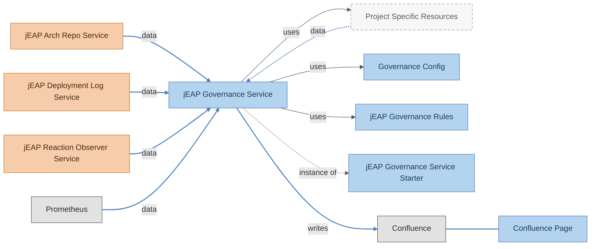

## Module Overview

| Module                             | Description                                                                                                                                                                                                   | Notes                                                                                     |
|-------------------------------------|-----------------------------------------------------------------------------------------------------------------------------------------------------------------------------------------------------------|--------------------------------------------------------------------------------------------|
| `jeap-governance-archrepo`         | Handles integration with the Architecture Repository. Loads the core model and persists it to the database. Can optionally load and persist: ApiDocVersion, DatabaseSchemaVersion, RestApiRelationWithoutPact | See [Configuration](configuration.md)                                                      |
| `jeap-governance-dataimport`       | Schedules the data import process                                                                                                                                                                             | See [Plugin mechanism](plugin-mechanism.md) and [Configuration](configuration.md)          |
| `jeap-governance-deploymentlog`    | Handles integration with the Deployment Log. Loads the deployment log component versions and persists it to the database.                                                                                     | See [Configuration](configuration.md)                                                      |
| `jeap-governance-reporting`        | Generates governance rule evaluation outcomes to Confluence                                                                                                                                                   | See [Reporting](reporting.md)                                                              |
| `jeap-governance-domain`           | Contains the core model, specifically System and SystemComponent, including data access interfaces                                                                                                            | -                                                                                          |
| `jeap-governance-persistence`      | Provides flyway migration scripts and JPA repositories                                                                                                                                                        | -                                                                                          |
| `jeap-governance-prometheus`       | Handles integration with a Prometheus server. Queries the latest samples of selected standard jEAP metrics for the system's service components and persists them to the database.                             | See [Configuration](configuration.md)                                                      |
| `jeap-governance-reactionobserver` | Retrieves the last observed reaction date of the system components.                                                                                                                                           | See [Configuration](configuration.md)                                                      |
| `jeap-governance-secscan`          | Scans the known HTTP APIs of the system components for unprotected endpoints and persists the flagged endpoints in the database.                                                                              | See [Configuration](configuration.md)                                                      |
| `jeap-governance-rules`            | Provides the infrastructure to evaluate governance rules and score services/systems on a regular basis                                                                                                        | Instances can define this as their parent                                                  |
| `jeap-governance-rules-core`       | Built-in governance rules shipped with the service                                                                                                                                                            | Included transitively via `jeap-governance-rules`; see [Rules](rules.md)                  |
| `jeap-governance-rules-dependency` | Built-in governance dependencies rules shipped with the service                                                                                                                                               | Included transitively via `jeap-governance-rules`; see [Rules](rules.md)                  |
| `jeap-governance-rules-messaging`  | Built-in governance messaging rules shipped with the service                                                                                                                                                  | Included transitively via `jeap-governance-rules`; see [Rules](rules.md)                  |
| `jeap-governance-rules-pact`       | Built-in governance consumer-driven-contract (CDC/PACT) rules shipped with the service                                                                                                                        | Included transitively via `jeap-governance-rules`; see [Rules](rules.md)                  |
| `jeap-governance-service-instance` | Module for easily creating an instance of the governance service                                                                                                                                              | Instances can define this as their parent                                                  |
| `jeap-governance-web`              | Contains REST interfaces and the application itself                                                                                                                                                           | -                                                                                          |

## Domain Model

### Core Model

The core model consists of Systems and their associated System Components.

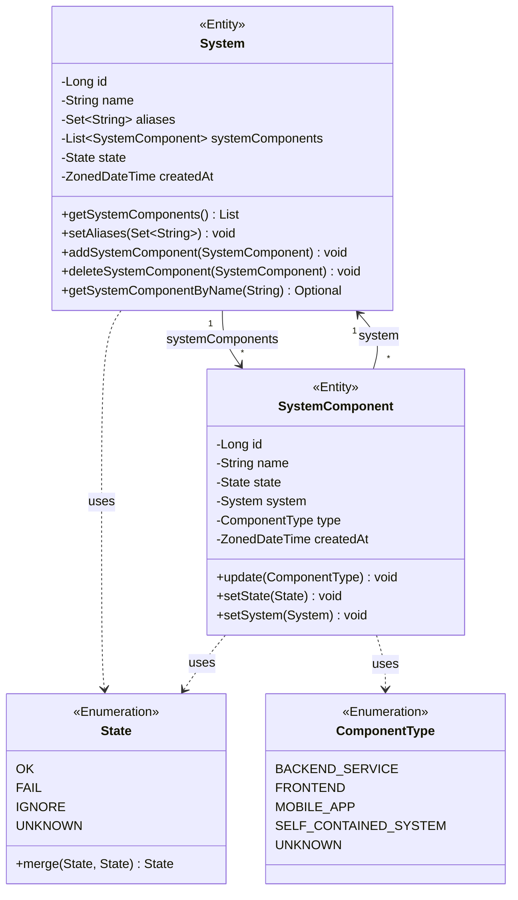

### Scoring and Rule Models

The scoring model consists of ComponentScore and SystemScore, which are used to capture the results of governance rule
evaluations. The rule model consists of the RuleState of a single system component, and the RuleConformanceRate, which
captures the overall conformance of a rule across all evaluated components.

The ComponentScoreCalculator and SystemScoreCalculator are responsible for calculating the scores based on the
active governance rules and their evaluation results.

A rule for a component can be in any of the following four rule states after evaluation:

- OK: The rule is active and the component complies with the rule.
- FAIL: The rule is active but the component does not comply with the rule.
- PAUSED: The rule is temporarily paused due to a temporary exemption.
- DISABLED: The rule is disabled due to an indefinite exemption.

A component's score is defined as the percentage of active rules that are in the OK state, weighted by the importance
of each rule. A rule is disabled if it has an indefinite exemption. The formula is as follows:

```
score = 100 * (sum(ruleWeight)[ruleState == OK] / sum(ruleWeight)[ruleState != DISABLED])
```

The system score is calculated as the average of the component scores of all components belonging to the system.

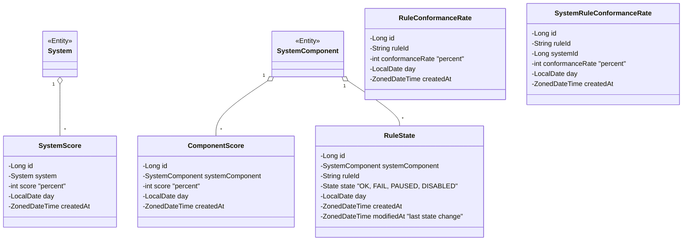

### ArchRepo Model

The ArchRepo model consists of ApiDocVersion, DatabaseSchemaVersion, and RestApiRelationWithoutPact.

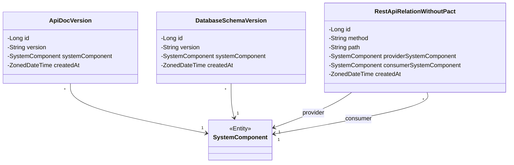

### DeploymentLog Model

The DeploymentLog model consists of DeploymentLogComponentVersion.

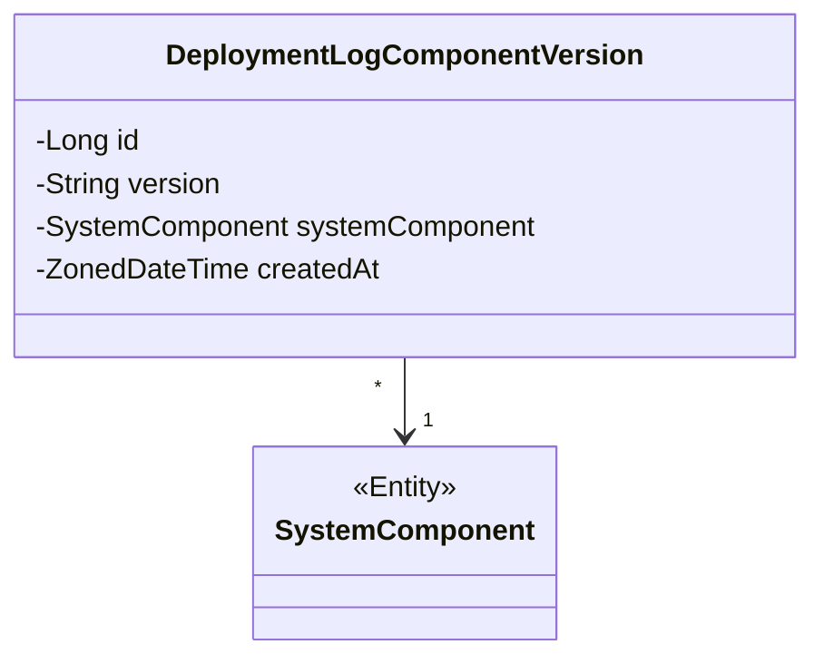

### ReactionObserver Model

The ReactionObserver model consists of ReactionObserverComponentLastObservationDate.

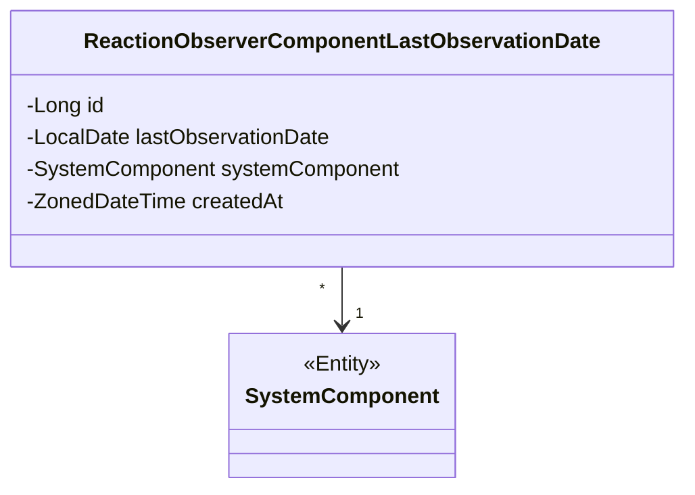

### Prometheus Time Series Model

The Prometheus domain model records time series samples per service component and query type. Since import queries are
designed to capture the current state of a component aspect (not to retrieve extended time series) only a limited number
of time series samples is expected. Consequently, the model intentionally remains denormalized to keep the domain and
implementation straightforward.

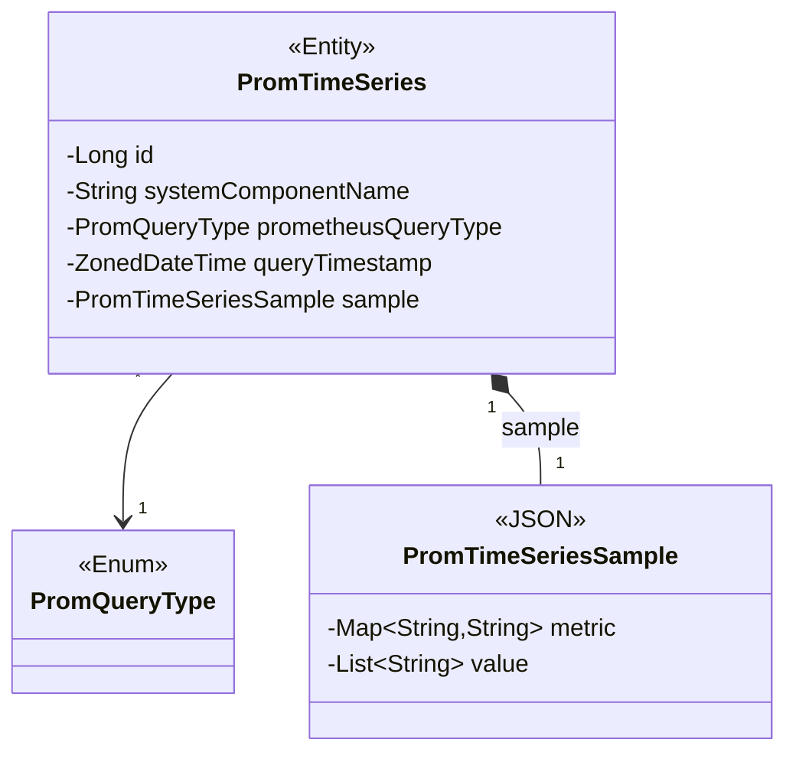

### Security Scan Model

The secscan module implements a security scan of known system component APIs to identify unprotected endpoints. Known
APIs of a system component are identified via the API discovery service. This service queries a jEAP architecture
repository instance for a system component's REST endpoints. Those endpoints are then checked for security by executing
HTTP requests on them. Endpoints accepting and not rejecting the requests are flagged as unprotected. The scan
result details for flagged endpoints are persisted to SecscanFlaggedEndpoint entities. In addition, a summarizing scan
message is persisted per system component in a SecscanState entity. A configurable endpoint filter allows to filter out
certain APIs and endpoints from the scan, e.g. to exclude APIs or endpoints that are expected to be unprotected.

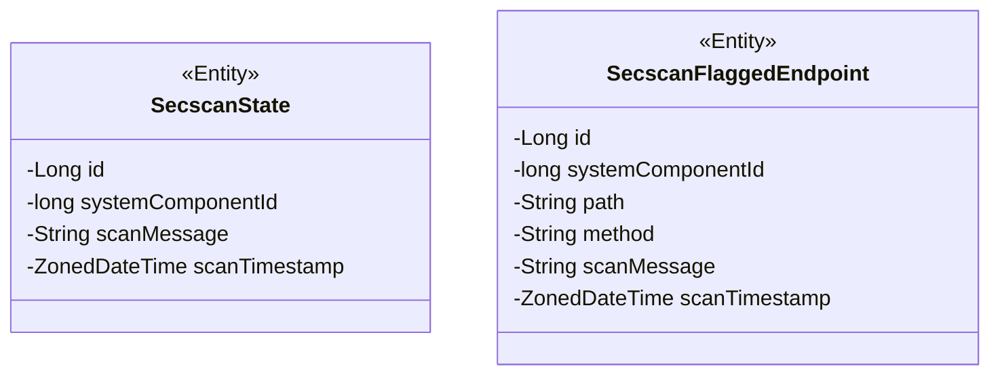

## Database

### Flyway Migration Strategy

We use major version namespaces to clearly separate database migrations for the core and for each plugin/service instance.

#### Version Ranges

| Range                   | Purpose                                                            |
|-------------------------|--------------------------------------------------------------------|
| `V1_*`                  | Core schema - Shared database structure used by all services       |
| `V1000_*` to `V1999_*'  | Reserved for modules within the jeap-governance-service reposiotry |
| `V2000_*` and higher    | Service/plugin-specific migrations                                 |

#### Flyway Configuration

We enable out-of-order migrations to allow independent evolution of plugins and services:

```yaml
spring:
  flyway:
    out-of-order: true
```

### Core Schema

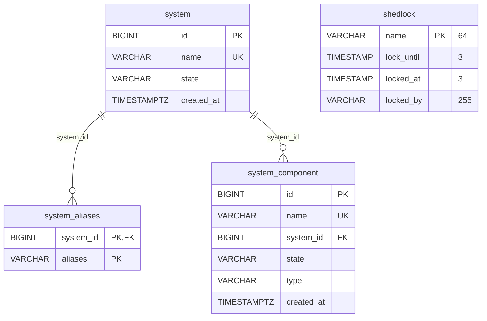

Notes:
- `system.name` and `system_component.name` have `UNIQUE` constraints.
- `system_aliases` has a composite primary key `(system_id, aliases)`.
- `shedlock` is used for distributed locking (ShedLock library) and is unrelated to the domain tables above.
- Indices: `system_name ON (name)`, `system_aliases_system_id ON (system_id)`, `system_component_name ON (name)`.

### Scoring Schema

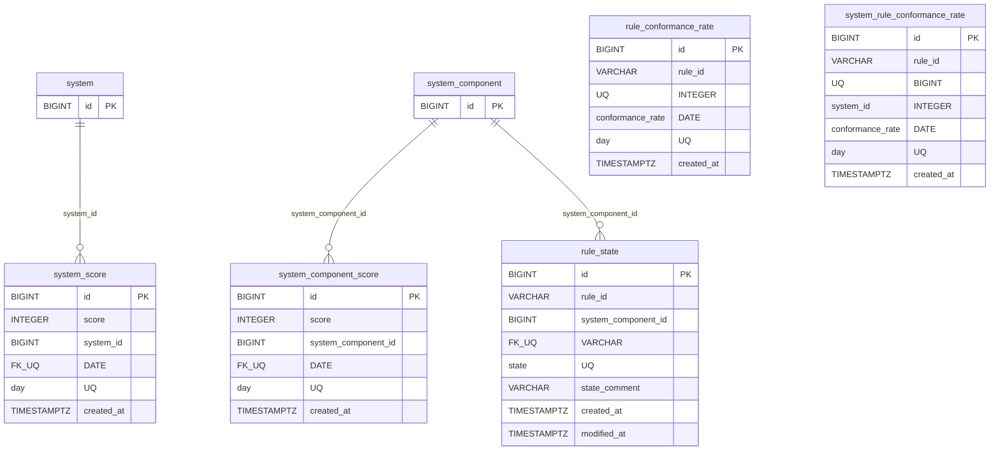

Notes:
- `(system_component_id, day)` on `system_component_score`, `(system_id, day)` on `system_score`, `(system_component_id,
  rule_id, day)` on `rule_state`, `(rule_id, day)` on `rule_conformance_rate`, and `(rule_id, system_id, day)` on
  `system_rule_conformance_rate` are unique — one row per entity/rule per day.
- `rule_state.modified_at` tracks the last state change, distinct from `created_at`.

### Scheduler Run Table

The `scheduler_run` table persists the last successful run timestamp per scheduler job (data-import, scoring,
reporting).
This ensures that the `jeap_governance_service_*_last_run_from` metrics report correctly even after application restarts
or redeployments.

| Column        | Type        | Description                                       |
|---------------|-------------|---------------------------------------------------|
| `job_name`    | `VARCHAR`   | Primary key, identifies the scheduler job         |
| `last_run_at` | `TIMESTAMP` | Timestamp of the last successful run for this job |

### ArchRepo Schema

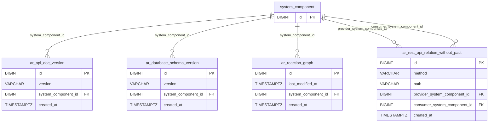

Notes:
- All FK relationships reference `system_component.id` from the domain package.
- All archrepo tables use `TIMESTAMP WITH TIME ZONE` for temporal columns.
- Indices are created on all foreign key columns for optimal query performance, e.g.
  `ar_rest_api_relation_without_pact_provider_system_component_id` and
  `ar_rest_api_relation_without_pact_consumer_system_component_id`.

### DeploymentLog Schema

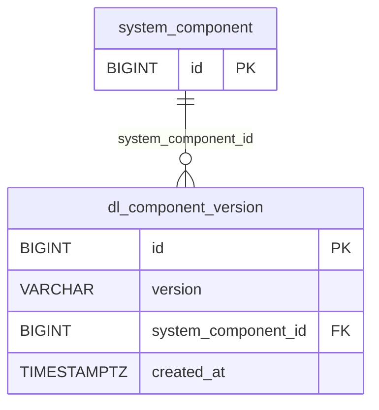

Notes:
- All FK relationships reference `system_component.id` from the domain package.
- All deploymentlog tables use `TIMESTAMP WITH TIME ZONE` for temporal columns.
- Indices are created on all foreign key columns for optimal query performance (e.g.
  `dl_component_version_system_component_id`).

### ReactionObserver Schema

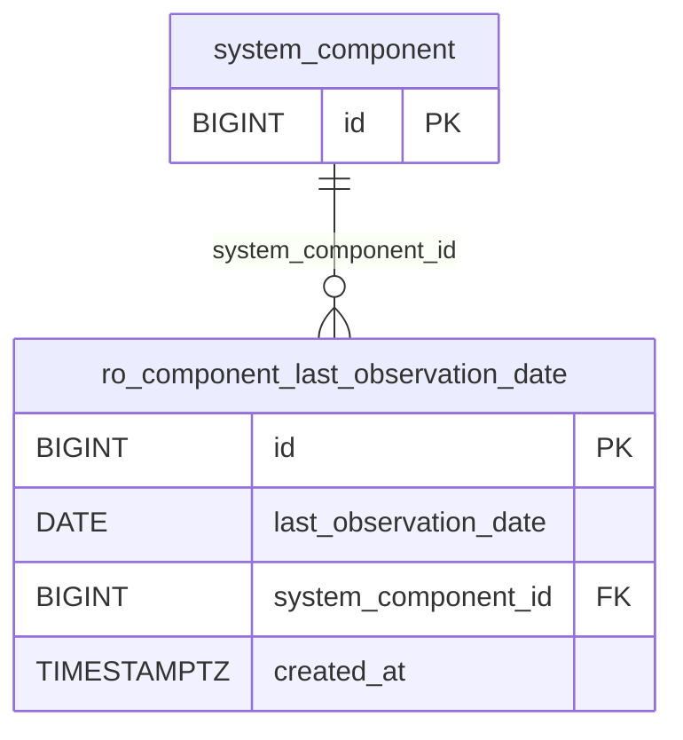

Notes:
- All FK relationships reference `system_component.id` from the domain package.
- Index: `ro_component_last_observation_date_system_component_id`.

### Prometheus Time Series Schema

The Prometheus database schema is designed around the assumption that import queries capture the current state of a
component aspect rather than extended time series. As a result, only a limited number of samples is expected to be
stored. Consequently, the schema intentionally remains denormalized (avoiding additional normalization of sample
storage) to keep both the data model and the implementation straightforward.

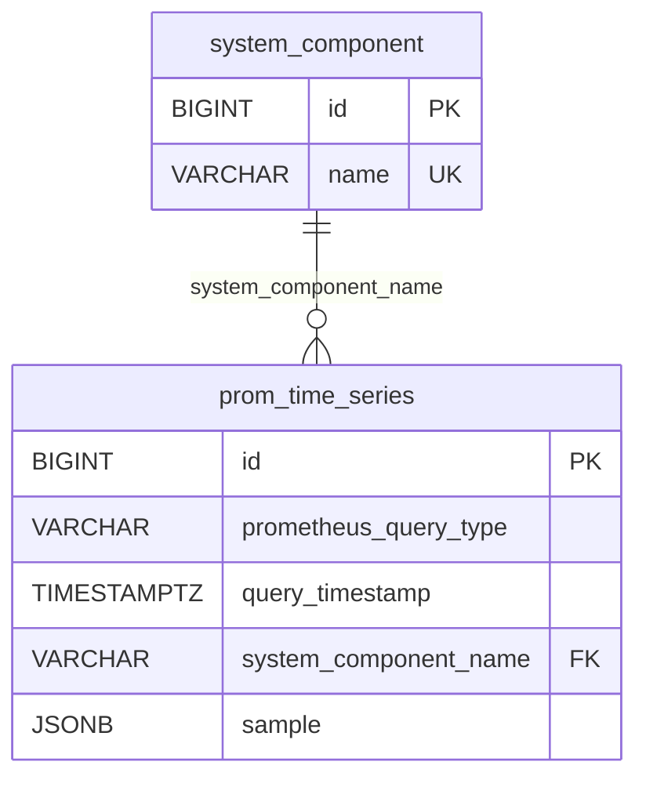

%% Database Schema: ch.admin.bit.jeap.governance.prometheus.domain

### Security Scan Schema

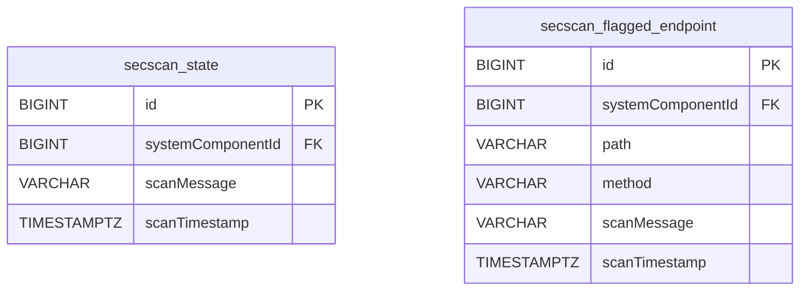

%% Database Schema: ch.admin.bit.jeap.governance.secscan.domain — `systemComponentId` in both tables
%% references `system_component.id` from the domain package.

## See also

- [Configuration](configuration.md) — configuration properties for the modules described above.
- [Rules](rules.md) — the built-in governance rules and how to write custom ones.
- [Plugin mechanism](plugin-mechanism.md) — data import and data deletion extension points.
- [Reporting](reporting.md) — Confluence report generation.
- [Metrics](metrics.md) — Prometheus metrics and recommended alerts.
